# Aadil & Partners Legal

**CS5450 Mobile Programming**

**Challenge 2: Flutter Mobile Portfolio**

**Group #1: Law Firm Portfolio**

**App name:** Aadil & Partners Legal

**Tagline:** Strategic Legal Counsel. Built on Trust.
**GitHub repository:** https://github.com/luqi101/Mobile_Programming_Challenge_2.git

## Group Members

| Student ID | Name |
|---|---|
| 1312122 | Aadil, Luqman |
| 1339707 | Sahil |
| 1307462 | ELDELNGATY, ABDELRAHMAN M |
| 1338099 | OMAR ALI, AHMED |
| 1311002 | ANUJIN, SAINZOLBOO |
| 1297799 | Arora, Pranay Rajesh |
| 1340827 | Avaiya, Om Jayeshbhai |
| 1332900 | Avecillas Segovia, Danilo Nicolas |
| 1296844 | Juntao Wen |

## Project Overview

Aadil & Partners Legal is a professional Flutter/Dart mobile portfolio app for a fictional full-service law firm. The app presents the firm's brand identity, practice areas, fictional attorneys, representative matters, legal resources, FAQ content, and a validated consultation request form.

The project is built as a complete CS5450 Challenge 2 submission. Android emulator support is the primary demonstration target, with Flutter web included as a secondary responsive check. Portfolio content is stored in Cloud Firestore, and the included seed JSON file documents the original fictional data used to populate the database.

## Feature Summary

- Firebase-initialized Flutter app with a controlled loading path.
- Professional Material 3 law firm visual design with deep navy, ivory, charcoal, and gold accent colors.
- Responsive mobile layout with bottom navigation for Home, Services, Team, Resources, and Contact.
- Firestore-backed firm profile, practice areas, attorneys, representative matters, testimonials, legal resources, and FAQs.
- Practice area cards and detail screens for eight law firm service categories.
- Fictional attorney profiles with credentials, experience, specialization, and detail screens.
- Original legal resources and expandable FAQ content.
- Consultation request form with full name, email, optional phone, preferred practice area, message, and consent acknowledgement.
- Valid contact submissions are written to the Firestore `contact_requests` collection with a server timestamp and `source: "mobile_app"`.
- Debug-only seed utility and a CLI seeding script for reproducible Firestore setup.
- Local seed JSON fallback exists only to prevent a broken demo state if Firestore is temporarily unavailable.

## Firebase Configuration

This project uses:

- `firebase_core` for Firebase initialization.
- `cloud_firestore` for portfolio data reads and consultation request writes.

Configured Firebase project:

- Firebase project ID: `aadil-legal-g1-68e92`
- Firebase display name: `aadil-legal-g1`
- Android package/application ID: `com.aadilpartners.legalportfolio`
- Firestore database: `(default)`
- Firestore region: `northamerica-northeast1`

The Flutter app initializes Firebase in `lib/main.dart` with:

```dart
Firebase.initializeApp(
  options: DefaultFirebaseOptions.currentPlatform,
)
```

The real FlutterFire configuration is generated locally and intentionally ignored by Git:

```text
lib/firebase_options.dart
android/app/google-services.json
```

Safe examples are committed for documentation:

```text
lib/firebase_options.example.dart
android/app/google-services.example.json
```

No Firebase service account keys, private keys, or sensitive credentials are included in this repository.

## Firestore Data Model

| Collection | Purpose |
|---|---|
| `firm_profile/default` | Firm name, tagline, overview, mission, values, stats, contact information, and disclaimer |
| `practice_areas` | Law firm service areas and detail content |
| `attorneys` | Fictional lawyer profiles |
| `representative_matters` | Anonymized fictional representative matters |
| `testimonials` | Fictional testimonials using client initials only |
| `resources` | Original legal insight/resource articles |
| `faqs` | Frequently asked questions and answers |
| `contact_requests` | Validated consultation form submissions |

The portfolio collections are publicly readable for the app demo. Public writes to portfolio collections are denied. The `contact_requests` collection allows create-only writes with validation and denies public read, update, and delete access.

Firestore configuration files:

```text
firebase.json
firestore.rules
firestore.indexes.json
```

Deploy rules and indexes with:

```bash
firebase deploy --only firestore:rules,firestore:indexes --project aadil-legal-g1-68e92
```

## Firestore Seeding

Seed data is stored in:

```text
assets/data/portfolio_seed.json
```

The project includes a CLI seeding utility:

```text
tool/seed_firestore.dart
```

Run the seeder after Firebase configuration and Firestore database creation:

```bash
dart run tool/seed_firestore.dart
```

The seeding workflow writes deterministic documents for:

- `firm_profile`
- `practice_areas`
- `attorneys`
- `representative_matters`
- `testimonials`
- `resources`
- `faqs`

The seeder does not create real contact requests. Contact requests are created only through validated form submissions or explicit validation testing.

Additional notes are available in:

```text
docs/firebase_seed_instructions.md
```

## Setup Instructions

Install prerequisites:

- Flutter stable SDK
- Android Studio with Android SDK and at least one Android emulator
- Firebase CLI
- FlutterFire CLI

Verify Flutter:

```bash
flutter --version
flutter doctor
```

Install dependencies:

```bash
flutter pub get
```

If Firebase needs to be reconfigured on another machine:

```bash
firebase login
dart pub global activate flutterfire_cli
flutterfire configure \
  --yes \
  --project=aadil-legal-g1-68e92 \
  --platforms=android,web \
  --android-package-name=com.aadilpartners.legalportfolio \
  --out=lib/firebase_options.dart
```

This command recreates both `lib/firebase_options.dart` and `android/app/google-services.json`. These generated files are required to run the app locally, but they are not committed to the public GitHub repository because they contain Firebase client API keys.

Set the Firebase project:

```bash
firebase use aadil-legal-g1-68e92
```

Deploy Firestore rules:

```bash
firebase deploy --only firestore:rules,firestore:indexes --project aadil-legal-g1-68e92
```

## Run Instructions

Run on Android emulator:

```bash
flutter run
```

Build an Android debug APK:

```bash
flutter build apk --debug
```

Optional Chrome responsive check:

```bash
flutter run -d chrome
```

Android emulator execution is the primary demonstration path for this submission. Chrome/web is included only as an additional platform check.

## Project Structure

```text
.
|-- AGENTS.md
|-- MC_Challange2_2026NN.pdf
|-- README.md
|-- README.pdf
|-- analysis_options.yaml
|-- android/
|   |-- app/
|   |   `-- google-services.example.json
|-- assets/
|   `-- data/
|       `-- portfolio_seed.json
|-- docs/
|   |-- firebase_seed_instructions.md
|   `-- screenshots/
|       |-- 01_home.png
|       |-- 02_practice_areas.png
|       |-- 03_practice_areas_more.png
|       |-- 04_practice_area_detail.png
|       |-- 05_team.png
|       |-- 06_attorney_detail.png
|       |-- 07_resources.png
|       |-- 08_resource_detail.png
|       |-- 09_contact_form.png
|       |-- 10_faq_collapsed.png
|       |-- 11_faq_expanded.png
|       `-- README.md
|-- firebase.json
|-- firestore.indexes.json
|-- firestore.rules
|-- ios/
|-- lib/
|   |-- app.dart
|   |-- firebase_options.example.dart
|   |-- main.dart
|   |-- core/
|   |-- data/
|   |-- features/
|   `-- shared/
|-- pubspec.lock
|-- pubspec.yaml
|-- screenshots/
|-- test/
|-- tool/
|   |-- build_readme_pdf.py
|   `-- seed_firestore.dart
`-- web/
```

## Screenshots

The following screenshots were captured from the Android app and are included in `docs/screenshots/`.

<table>
  <tr>
    <td align="center">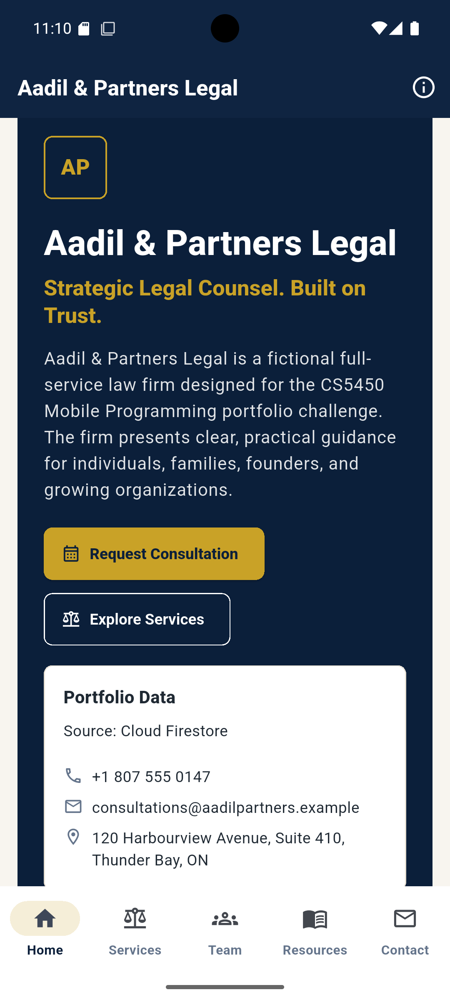<br><strong>Home</strong></td>
    <td align="center">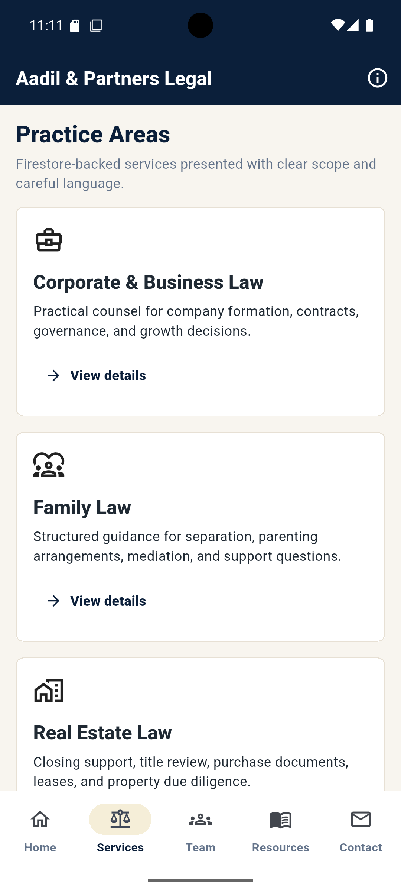<br><strong>Practice Areas</strong></td>
    <td align="center">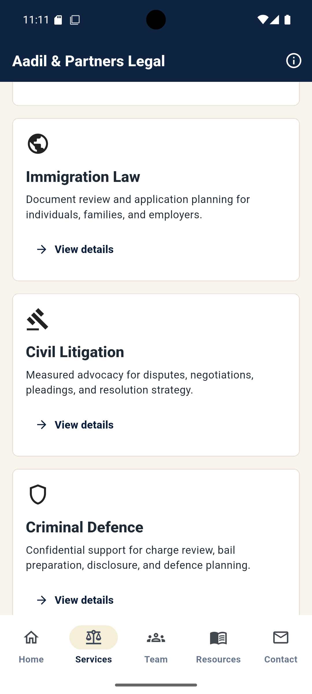<br><strong>Services List</strong></td>
  </tr>
  <tr>
    <td align="center">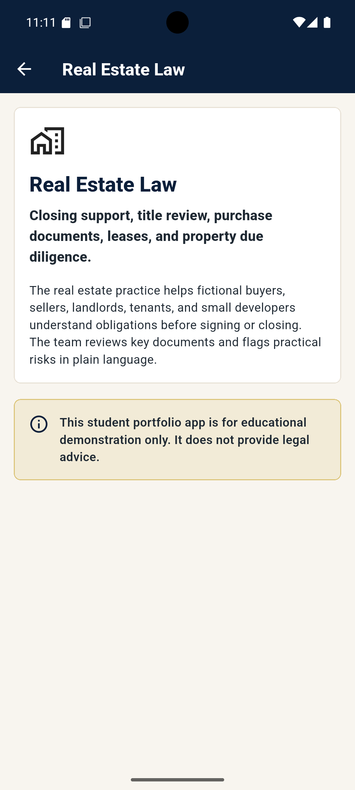<br><strong>Service Detail</strong></td>
    <td align="center">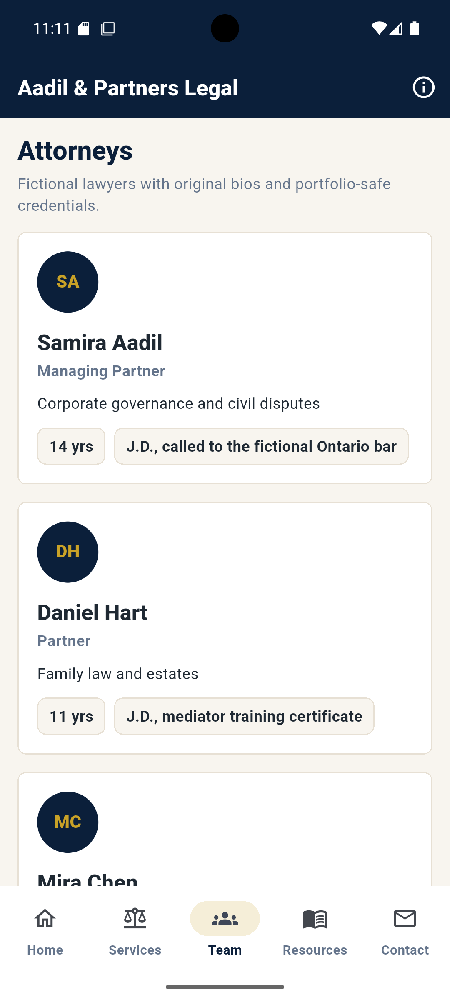<br><strong>Team</strong></td>
    <td align="center">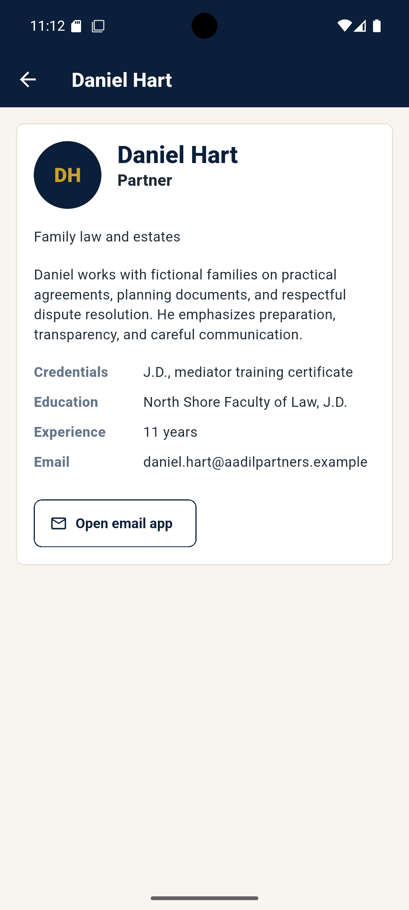<br><strong>Attorney Detail</strong></td>
  </tr>
  <tr>
    <td align="center">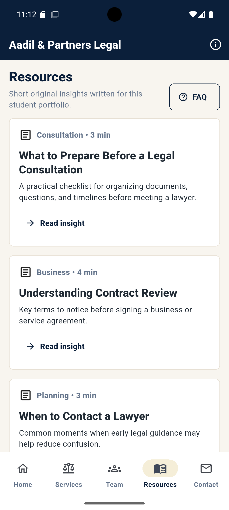<br><strong>Resources</strong></td>
    <td align="center">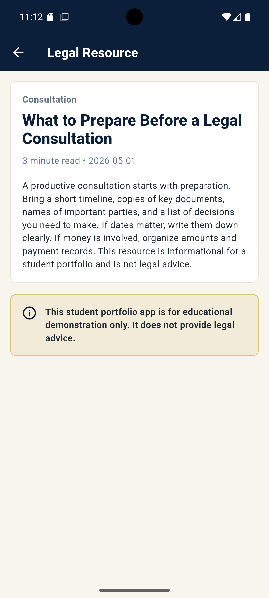<br><strong>Resource Detail</strong></td>
    <td align="center">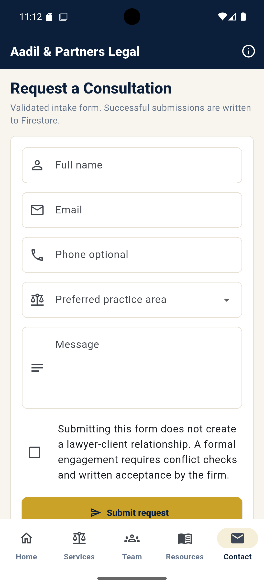<br><strong>Contact Form</strong></td>
  </tr>
  <tr>
    <td align="center">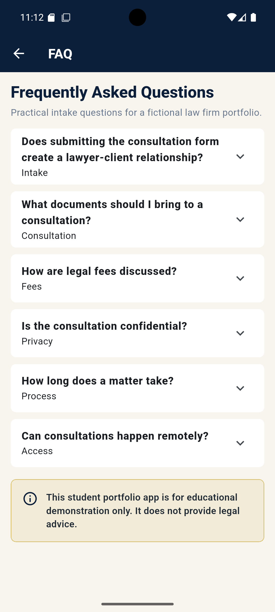<br><strong>FAQ</strong></td>
    <td align="center">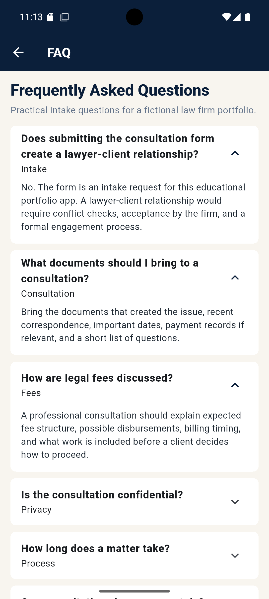<br><strong>Expanded FAQ</strong></td>
    <td align="center">Firestore-backed data verified through the running app, CLI validation, and contact form write testing.</td>
  </tr>
</table>

## Validation Results

Final validation completed successfully:

- `flutter pub get` passed.
- `dart format .` passed.
- `flutter analyze` passed with no issues found.
- `flutter test` passed.
- `flutter build apk --debug` passed and produced `build/app/outputs/flutter-apk/app-debug.apk`.
- Android emulator run was tested successfully by the project owner after Firebase configuration and seeding.
- Firestore portfolio seed verification showed documents in `firm_profile`, `practice_areas`, `attorneys`, `representative_matters`, `testimonials`, `resources`, and `faqs`.
- Contact request write behavior was verified against the `contact_requests` collection.

## Demo Flow

Recommended Zoom demonstration:

1. Open the app on an Android emulator.
2. Show the Home screen and confirm the app presents Aadil & Partners Legal.
3. Navigate to Services and open a practice area detail screen.
4. Navigate to Team and open an attorney profile.
5. Navigate to Resources and open a resource article.
6. Open the FAQ screen from Resources.
7. Navigate to Contact and submit a valid consultation request.
8. Confirm the request appears in the Firestore `contact_requests` collection.
9. Mention that all content, branding, biographies, testimonials, matters, and articles are fictional and original.

## ZIP Packaging Instructions

Include:

- `lib/`
- `android/`
- `ios/`
- `web/`
- `assets/`
- `docs/screenshots/`
- `screenshots/`
- `pubspec.yaml`
- `pubspec.lock`
- `README.md`
- `README.pdf`
- `firebase.json`
- `firestore.rules`
- `firestore.indexes.json`
- all Dart source files and tests

Do not include:

- `build/`
- `.dart_tool/`
- `.gradle/`
- backup folders
- private keys
- Firebase service account JSON
- local machine caches

## Academic Originality Statement

All law firm branding, attorney biographies, testimonials, representative matters, resource text, and UI composition are fictional and created for this project. The app does not copy real law firm branding, real attorney profiles, real client testimonials, or unlicensed images.

## Legal Disclaimer

This app is an educational student portfolio project. It does not provide legal advice. Submitting the consultation request form does not create a lawyer-client relationship. Representative matters are fictional examples and do not guarantee any result.

## Known Limitations

No build-blocking limitations are known for the Android emulator demonstration. The app is configured for Android and web through FlutterFire; Android is the primary graded demo target.
